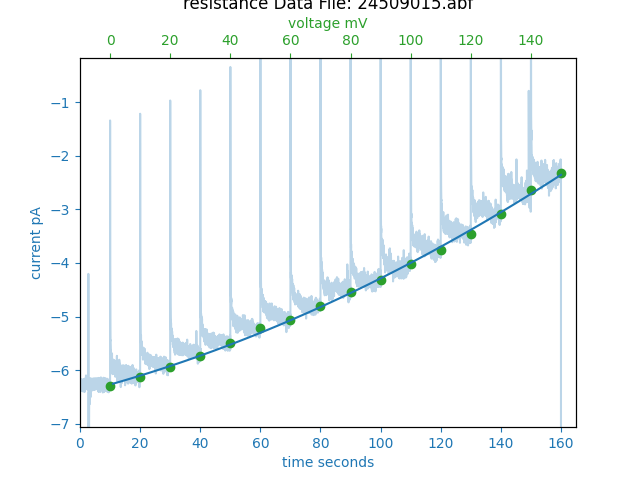
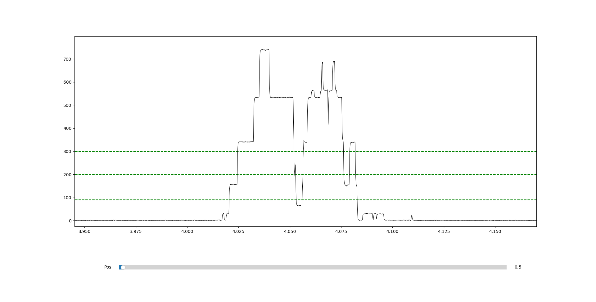

# ResistanceRamp

@author: grabills

# Guide to Analyzing CA1 Step Resistance Measurements

This guide will help you understand how to analyze CA1 step resistance measurements without using the PClamp software suite. This process involves simulating the behavior of an LCR circuit, which PClamp cannot measure directly through the voltage step procedure. The analysis uses a program called `ResistanceRamp.py`.

## Overview

Our experimental setup involves applying a voltage through an electrode in a salty water solution, which is similar to current flowing through a wire. A capacitor, representing a bilayer, is placed between the positive and negative terminals. As we shift the voltage across it, the capacitor causes an exponential decay since the voltage across a capacitor cannot change instantly. This is why we use the Resistance Ramp procedure.

## Setup Instructions

1. **Organize Data**: Place all the data you want to analyze in a directory that you can access from your terminal.
2. **Compile the Program**: Navigate to that directory in your terminal and compile the `ResistanceRamp.py` script. This tells the program to analyze the data within the specified path.

## How to Use

The basic user interface is a prompt with 3 options:

```python
rerun a file: "rerun"
continue to current file: "cont"
press enter to quickly move through files
go to specific index: "number"

#User input Cont
Enter values:
```

- `rerun`: shifts index back so previous file can be analyzed again.
- `cont`: will begin analysis on file.
- `number`: will go to a specific file number and give index base 0.
- `enter`: pressing enter will quickly iterate through files and resume `cont` from a new starting position.

## What data looks like

The AS1 Files have 3 axises: voltage, current, and time. Two regressions are performed linear and quadratic.
using the `cont` and other functions users can see their AS1 file recordings and remove data through the UI the user can `enter values` they wish to remove from the voltages on the upper axis of the graphs below:

Linear regression:


Quadratic Regression:


## Key Functions and Their Roles

- **`calculate_standard_error`**: This function calculates the standard error for a given list of data points.

- **`low_pass`**: This function applies a Gaussian filter to the dataset (`abf.sweep(x,y)`) to reduce noise. Here, `x` corresponds to voltage and `y` to current. The Gaussian filter smooths the data based on a parameter called sigma.

- **`filter`**: This function removes data points marked as (NaN) by the `low_pass` function. Note that this currently does not adjust other datasets accordingly, which can cause issues for the `n_reg` function.

- **`n_reg`**: This function graphs the voltage and current data and performs exponential regression. It calculates the average values at the end of each data section and allows users to remove unwanted points. It also provides an R-squared value to estimate the data fit.

- **`averageI`**: This function segments the `abf.sweep(x,y)` data into sections, averaging the values over a specified time interval (2 seconds for 2023 purposes, but this can be adjusted). The time array is in milliseconds and does not include the initial upward step to avoid introducing high outliers.

## Additional Notes

- **OS Integration**: The program is designed to work based on the directory from which it is called. It iterates through all files in the specified directory, and you can choose where to save the results.
- **Excel**: The excel integration works very similar to `Create_ideal_trace_abf_false_positives_version2.py`. A dataframe is created, which allows for all of the post processed data to be stored and exported.
- **Limitations**: Some functionality, such as adjusting datasets alongside filtering, is not fully implemented. This can create challenges, particularly for graphing with the `n_reg` function.

# _Create_ideal_trace_abf_false_positives_version2.py_
### For MacOS/Linux: change any rf"{something}\\{something}" to f"{something}/{something}". Note that backslash changes to forward slash.

## The function of this code is to analyze the opening lengths and ratios of measured ion channels.
```python
select lipid:
1: DOPE
2: DOPC
3: POPC

#user Responds

1: Next file and record data
2: Remove noise
3: Graph
4: Manually set pA level
5: Change file
6: Change settings
7: Export raw data in time range
8: End analysis and export excel

#user enters 2

Ion channel activation graph removed data by user input [low high low high...]
```

- The `Lipid` holds the type of lipid user used for excel and tracking purposes.
- The `Next file and record data` records data for excel output later and proceeds to next file.
- The `Remove Noise` allows user to input ranges of noise to be removed by `large_spike`.
- The `Graph` graphs a hisogram with a specific low-pass filtering then when closed will graph the Ion-Channel data.
   whith activity individual openings similar to: 
  The `Manually set pA level` prompts the user to manually set individual or all pA level bins.
- The `Change file` eithergoes back to previous file so it can be re analysised or jumps to file input by user (with input: `000`). Does not record data from current file.
- The `Change settings` prompts user to change the lowpass filtering on data or the histogram domain.
- The `Export raw data in time range` prompts user to export raw ion channel activation data over a time range or to export all dwell times to an excel file.
- The `End analysis and export excel` ends the program and exports the dataframe to an excel file with all data corresponding to specific file.
  
  In summer 2024, Create_ideal_trace_abf_levels_version2 was overhauled to fix bugs, reduce crashes, optimize performance, and add functionality, culminating in Create_ideal_trace_abf_levels_version3. Added functionality includes a peak-finding algorithm, dwell time analysis with filtering, and a more complete excel file export including error bar calculations and other dwell time and general calculations based on filter time.

## Functionality:
- Low-pass filtering of ion channel excitation data.
- Automated (although imperfect) pA level binning.
- Dwell time analysis.
- Dynamic functionality based on user inputs for graph visuals, cutoff, etc.
- Automated calculation for analysis, including error bars.

## Recommended procedure:
The directory the code runs from must be the folder where the files to be analyzed are stored. Use files from a single data run in each folder. Follow user interface to run code.
Before running program set path to file directory. Setup code by changing variables noted in findLevels() method. Notes for setting variables are stated next to variables. - 1: Choose lipid. 
- 2: Check histogram and setup code as stated before.
- 3: Create new excel file/sheet for data run analysis notes. I recommend columns for file number, temperature, voltage, noise removed, levels manually altered, and notes (Example in "Summer2024 Data and Analysis" folder - "ION Channel Analysis File Notes" excel sheet). Add any other columns you find useful.
- 4: Run files as listed in file procedure.

### File procedure:
- 1: Graph data with `3: Graph` and check second figure (capacitance/time figure). List any noisy sections in applicable excel column. If file is too noisy remove entire time range. I recommend removing any good time range with less than 2 seconds between noisy parts to avoid p-hacking.
- 2: Remove noise in program with `2: Remove noise` from listed excel file ranges.
- 3: Check histogram level ranges against program's identified level ranges. Program will print level and reduced level ranges to terminal. Check each level and reduced level against histogram figure and alter if program misses maximum. Program misses are fairly frequent, so make sure to check diligently. Recommendations for setting levels are listed below.
  -If bounds are not visibly incorrect: leave as is for consistency reasons.
  -If only one bound is visibly incorrect: leave other bound as found by program. This is to remain consistent.
  -If bounds of seperate levels are overlapping, choose most obvious minimum as bound for both levels.
  -If levels -- especially level 0 -- are unclear, check excitations in second figure for clarity.
- 4: List any level range changes to be made in corresponding excel column.
- 5: Manually set pA level in program to match excel sheet.
- 6: Continue to next file.
- 7: When finishing analysis (either reaching end of file or exporting data) save "output.xlsx" as another name so file is not overwritten in the future. I recommend {date}+{lipid}

## User interface: 
- `1: Next file and record data`: Records data to export later and moves on to next file.
- `2: Remove noise`: Removes capacitance data in time range. This removes capacitance data everywhere in that time range and any analysis will skip over these time intervals. 
- `3: Graph`: Opens histogram figure of capacitance vs frequency. Then opens second figure of capacitance over time. Both must be closed before continuing. 
- `4: Manually set pA level`: Set all or individual capacitance level ranges (in pA/pF) based on histogram appearance. Individual changes are recommended in almost any case. 
- `5: Change file`: Rerun previous file or search for file based on 3-number code. 
- `6: Change settings`: Change cutoff frequency or histogram x-axis range. 
- `7: Export raw data in time range`: Export dwell times per level or capacitance data in time range in excel sheet. 
- `8: End analysis and export excel`: Stop program early and export excel sheet.

## Definition of Terms
- **Cutoff**: The amount of low pass filtering being applied to the data.
- **Voltage**: The voltage at which data was taken.
- **pA levels**: These are the variables to determine the activation levels, such as when the ion channel is closed. This separates data into helpful bins for analysis in Excel.

## Key Functions
- **Set Level**: Makes the variables the rest of the program uses, along with helping with formatting the ABF file reader.
- **Adjust Data**: Sets up data for analysis in set level function. Seperated for organization.
- **Histogram**: Takes the file you're in, the cutoff (low pass), and two arrays. It then graphs the filtered sweep. When graphing, avoid removing 0 or 60; instead, use 59.99 and 0.01.
- **Large Spike**: This method removes noise data from the arrays, so they won't be sampled for the histogram.
- **Find Levels**: This method makes automated guesses for each pA level -- must be checked by user.
- **Calculate Histogram Times**: Sorts activation levels (in pA) into frequency bins for analysis.
- **Find Dwell Times**: Finds dwell times for each  level based on levels based on either computer guess or user input. Filters dwell times based on set time in given dwell.
- **Analyze Dwell Times**: Does math on dwell time list.
- **Record Dwell Times**: Records math done in analyze dwell times to be exported in excel. Seperated for organization.
- **Record General Data**: Records math for non-dwell-time-related data to be exported in excel.
- **The Main UI**: Has features for moving to different files, noise removal, and graphing data. It allows users to segment activity into bins (e.g., closed, lv 0, lv 1, lv 2, etc.) and saves these settings between files.

### Additional Features

In the section after this, data is prepared for an Excel file. Time spent in each level is calculated, along with file number and other miscellaneous information. Immediately after, the overall Excel document creator synthesizes all created Excel files into one large file with all the data. Ideally, this won't be used until you are finished creating the individual files.

## Code Details

### Create_ideal_trace_abf_false_positives_version2.py

Allows a person to look at the idealized trace and identify false positives, then redraws the trace with the false positives accounted for. It also recalculates the average length and means, and finally formats and produces the Excel file.

### Functions

- **low_pass_filter_abf_version1**: A low pass filter.
- **ideal_trace_same_bin_version2**: A subroutine to determine if two values are in the same bin.
- **ideal_trace_combine_repeats_version2**: Combines consecutive events at the same level after removing false positives.
- **ideal_trace_calculate_mean_version2**: Finds the mean current and average length for each level.
- **ideal_trace_make_ideal_Y_list_version2**: Creates a list of Y values that form the idealized trace.
- **Ideal_trace_graph_formatting_version2**: Formats the graph of filtered data, idealized trace, and dotted lines at bin junctions with a scrollbar. Includes an input to adjust graph height.
- **set_level**: The set level function from **Create_ideal_trace_abf_set_levels_version2**.
- **histogram**: Creates the histogram, given the file location, start and stop times, and the low pass filter.
- **large_spike**: Performs noise removal. If insufficient, additional options from last year's code can be used.

```python
# Example code block for compiling Excel files
path = rf"{os.getcwd()}\\"
filenames = [file for file in os.listdir(path) if file.endswith('.xlsx')]

df = pd.concat([pd.read_excel(path + file) for file in filenames], ignore_index=True)
df.to_excel("output.xlsx")
```

### Inputs

- **Location**: The location on your computer where the Excel file will be saved, along with the file name.
- **spike_start**: A list of approximate start locations for large noise spikes.
- **spike_stop**: A list of corresponding stop locations for large noise spikes. Must be the same length as spike_start.

### Ideal_trace_graph_formatting_version2

- **top_Yvalue**: The upper value shown on the y-axis of the graph.

### Notes

- **Indexing** The `abf.sweepX` array has the data entries however they are not neetly segemented, so when a removal region is given to `large_spike` the program finds the value nearest from the input to the array and uses that.
